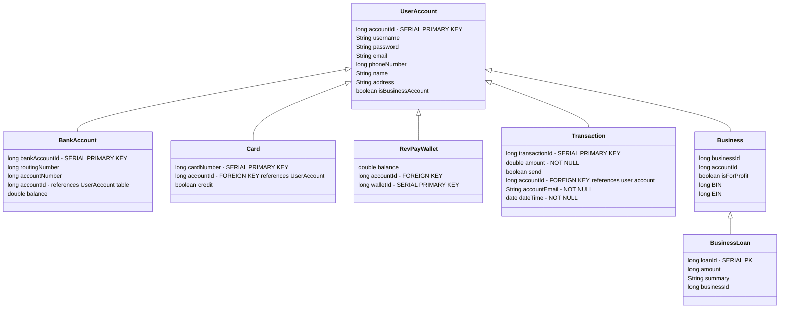

```mermaid
    classDiagram
        
        UserAccount <|-- BankAccount
        UserAccount <|-- Card
        UserAccount <|-- RevPayWallet
        UserAccount <|-- Transaction
        UserAccount <|-- Business

        UserAccount : long accountId - SERIAL PRIMARY KEY
        UserAccount : String username
        UserAccount : String password
        UserAccount : String email
        UserAccount : long phoneNumber
        UserAccount : String name 
        UserAccount : String address
        UserAccount : boolean isBusinessAccount   

        Business <|-- BusinessLoan

        Business : long businessId
        Business : long accountId
        Business : boolean isForProfit
        Business : long BIN
        Business : long EIN
        
        class BankAccount{
            long bankAccountId - SERIAL PRIMARY KEY
            long routingNumber
            long accountNumber
            long accountId - references UserAccount table
            double balance
        }
        class BusinessLoan{
            long loanId - SERIAL PK
            long amount
            String summary
            long businessId
        }
        class Card{
            long cardNumber - SERIAL PRIMARY KEY
            long accountId - FOREIGN KEY references UserAccount
            boolean credit
        }
        class Transaction{
            long transactionId - SERIAL PRIMARY KEY
            double amount - NOT NULL
            boolean send
            long accountId - FOREIGN KEY references user account
            String accountEmail - NOT NULL
            date dateTime - NOT NULL
        }
        class RevPayWallet{
            double balance
            long accountId - FOREIGN KEY
            long walletId - SERIAL PRIMARY KEY
        }
```
